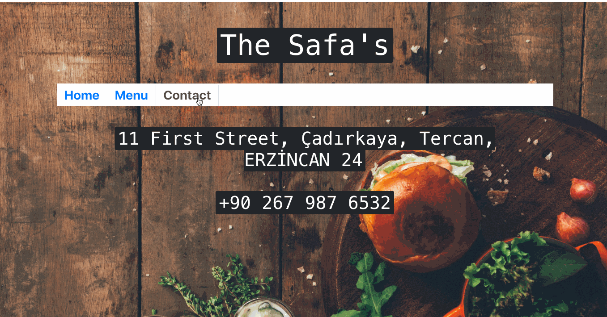

# Project: Restaurant Page
A simple restaurant application built with HTML, CSS & Javascript. 

<br />
<p align="center">

  <h1 align="center">The Safa's</h1>

  <p align="center">
    This project is part of the Microverse curriculum and is done as an exercise in the Javascript section.
    <br />
    <br />
    <a href="https://safaerden.github.io/Restaurant-Page/">View Demo</a>
    ·
    <a href="https://github.com/SafaErden/Restaurant-Page/issues">Report Bug</a>
  </p>
</p>



<!-- TABLE OF CONTENTS -->
## Table of Contents

* [About the Project](#about-the-project)
  * [Built With](#built-with)
* [Contact](#contact)
* [Acknowledgements](#acknowledgements)
* [License](#license)

<!-- ABOUT THE PROJECT -->
## About The Project

This project's purpose is to practive Javascript concepts like DOM manipulation and OOP with webpack.

<!-- [![Product Name Screen Shot][product-screenshot]][screenshot-url] -->

<!-- ABOUT THE PROJECT -->
## Installation

To use this app locally, this is what you need to:

* [Download](https://github.com/SafaErden/Restaurant-Page/archive/development.zip) or clone this repo:
  - Clone with SSH:
  ```
    git@github.com:SafaErden/Restaurant-Page.git
  ```
  - Clone with HTTPS
  ```
    https://github.com/SafaErden/Restaurant-Page.git
  ```
 

### Built With
This project was built using these technologies.
* HTML
* CSS
* JavaScript
* Bootstrap
* Chrome Dev Tools

<!-- CONTACT -->
## Contact

👤 **Safa Erden**

- LinkedIn: [Safa ERDEN](https://www.linkedin.com/in/safaerden/)
- GitHub: [Safa ERDEN](https://github.com/SafaErden)
- Twitter: [@safaerden](https://twitter.com/safaerden)
- E-mail: safaerden@gmail.com

<!-- ACKNOWLEDGEMENTS -->
## Acknowledgements
* [Odin Project](https://www.theodinproject.com/courses/javascript/lessons/restaurant-page)

## 📝 License

This project is [MIT](https://opensource.org/licenses/MIT) licensed.
